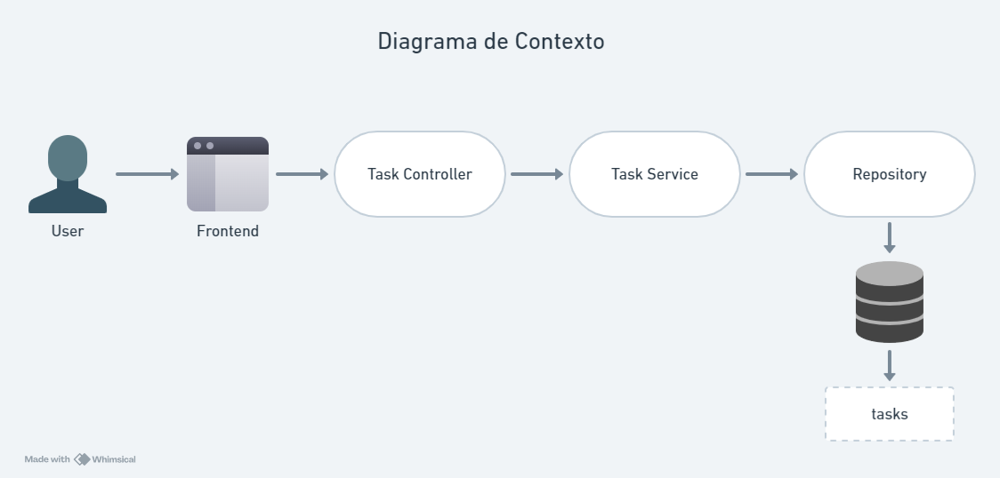

# Gerenciador de Tarefas 📝

Este é um projeto Java que utiliza o Maven como sistema de build, Spring Boot como framework e Spring Data JPA como ferramenta de gerenciamento e manutenção de banco de dados Postgres.

A aplicação é um **Gerenciador de Tarefas - Task Manager**, permitindo criar, listar, atualizar e deletar tarefas.

## Tecnologias

<div>
  
  
</div>

## Como Funciona

Para a organização estrutural, o projeto foi baseado no padrão de arquitetura MVC (Model-View-Controller)

- **TaskApplication.java**: Classe principal que inicia a aplicação Spring Boot.
  
- **TaskController.java**: Controlador que manipula as solicitações HTTP para operações CRUD de tarefas.
  
- **TaskService.java e TaskServiceImpl.java**: Interface e implementação do serviço com a lógica de negócios para gerenciamento de tarefas.
  
- **TaskRepository.java**: Repositório que interage com o banco de dados (Postgres) para persistir as tarefas.
  
- **TaskDTO.java**: Objeto de Transferência de Dados (DTO) usado para transferir dados de tarefas pela aplicação.
  
- **application.properties**: Arquivo de configuração para definir propriedades da aplicação Spring Boot, como configurações de banco de dados.
  
- **TaskApplicationTests.java**: Classe de testes unitários para a aplicação.

## Diagrama de Contexto



## Como Testar os Endpoints

Abra o terminal na raiz do projeto e execute o comando `mvn clean install`.
Após a compilação bem-sucedida, execute a aplicação.
A seguir, você pode escolher um dos caminhos:

**Swagger**

1. Com a aplicação em execução, abra um navegador web e acesse a URL http://localhost:8080/swagger-ui/index.html#.
2. Para testar um endpoint, clique nele, preencha os parâmetros ou corpo da requisição necessários e clique em "Try it out!".

**Postman**

1. Abra o Postman.
2. Clique em "New" e depois em "Request".
3. Digite a URL do endpoint que você deseja testar no campo de texto URL.
4. Selecione o método HTTP apropriado (GET, POST, PUT, DELETE, etc.).
5. Se necessário, adicione parâmetros, corpo da requisição e cabeçalhos.
6. Clique em "Send" para enviar a requisição.

### **Criar Tarefa (POST)**

- Endpoint: `http://localhost:8080/tasks/create`
- Corpo da Requisição (JSON):

    ```json
      {
        "title": "Tarefa",
        "description": "Essa é a descrição da tarefa",
        "completed": false,
        "dateOfConclusion": "2024-03-22"
      }
     ```

### **Listar Todas as Tarefas (GET)**

- Endpoint: `http://localhost:8080/tasks/list`

### **Atualizar Tarefa Existente (PUT)**

- Endpoint: `http://localhost:8080/tasks/update`
- Corpo da Requisição (JSON):

     ```json
      {
        "id": "1",
        "title": "Tarefa",
        "description": "Essa é a descrição da tarefa",
        "completed": false,
        "dateOfConclusion": "2024-03-22"
      }
     ```

### **Deletar Tarefa por ID (DELETE)**

- Endpoint: `http://localhost:8080/tasks/delete/{id}`
- Substitua `{id}` pelo ID da tarefa que deseja deletar.
  
Certifique-se de substituir `http://localhost:8080` pela URL correta da sua aplicação, se necessário.

## Próximos passos

Esta seção destaca as próximas etapas do projeto, bem como as funcionalidades em desenvolvimento para futura implementação. Aqui, você pode acompanhar o progresso e as melhorias que pretendo adicionar.

### Checklist de Funcionalidades Backend

- Implementação CRUD ✅
- Documentação Swagger ✅
- Documentação JavaDoc e Checkstyle ✅
- Diagrama de Contexto ✅
- Testes Unitários ✅

- Prototipagem
- Design de Interface
- Integração com a API do backend
- Responsividade para diferentes tamanhos de tela
- Testes de interface
